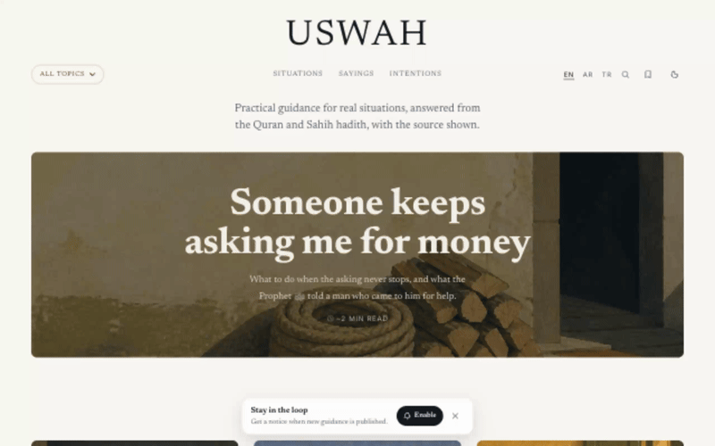
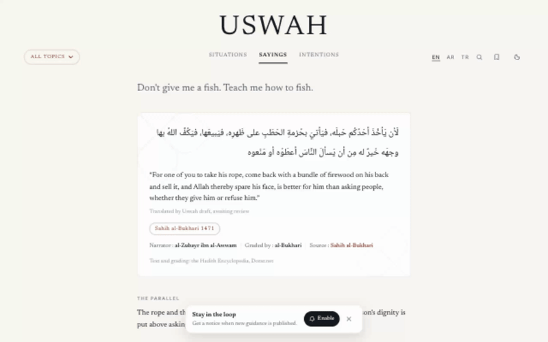
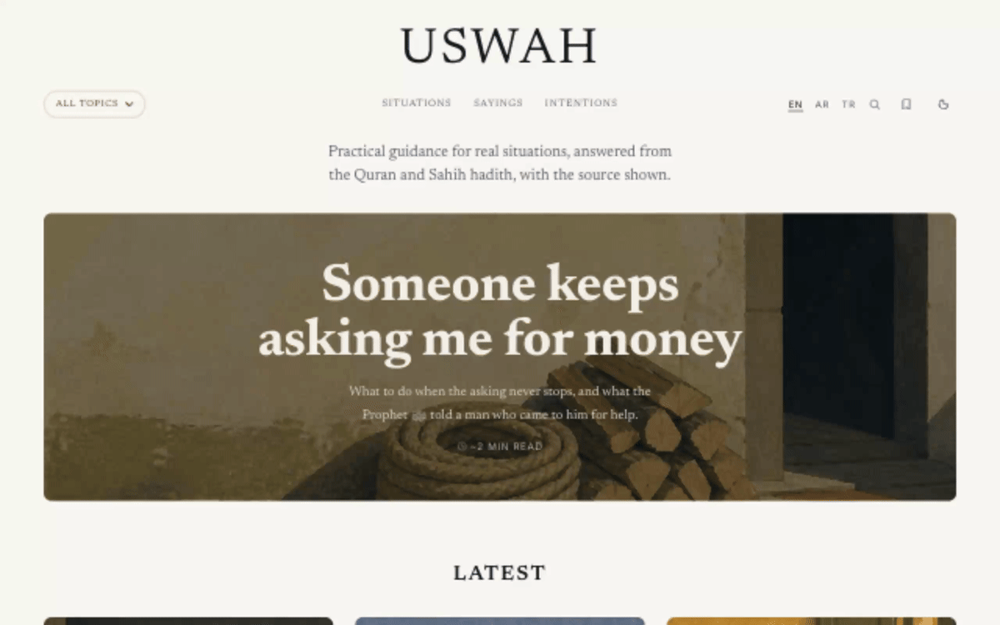

# Uswah

**[uswah.app](https://uswah.app)**

Practical guidance for real situations, drawn from the original source — Quran and the
two Sahih collections. A web surface for search and SEO, a Flutter app, one shared database.

Name: أسوة, from Quran 33:21 — *"in the Messenger of Allah you have a beautiful example."*




| Share a saying as an image | Light / dark | English → Arabic (RTL) |
| --- | --- | --- |
|  |  |  |

## Layout

```
supabase/          Schema, migrations, tests, seed data   ← the contract. Seif owns it.
apps/web/          Next.js: public site                   ← Seif
apps/dashboard/    Next.js: content review dashboard      ← Seif
apps/mobile/       Flutter: iOS + Android                 ← [friend]
```

Turborepo + pnpm workspace at the root: `pnpm dev` / `pnpm build` fan out to the Next.js
apps. Flutter shares no code with them — only the database — so `apps/mobile` stays out
of the workspace and builds on its own.

## Who touches what

- **Only Seif edits `supabase/`, `apps/web/` and `apps/dashboard/`.** Only [friend] edits `apps/mobile/`.
- **Nobody edits the other's folder**, including "just a quick fix". Open an issue instead.
- **Schema changes are additive and never in place**: a new timestamped file in
  `supabase/migrations/`, never an edit to one already applied. Announce it before applying —
  the app is reading those columns in production.
- **Neither client writes content.** Both read via the publishable key under RLS. Content
  writes happen only from the dashboard using the service role, server-side.

Branch names: `web/<thing>` and `app/<thing>`. You will almost never touch the same files,
so conflicts should only ever happen in `supabase/`.

## Database

Project `uswah` · `rjkbhobntyhuochdmkkx` · eu-central-1.

Copy `.env.example` to `.env.local`. The publishable key is safe to commit and ship in both
clients — RLS is the security boundary, not the key. The service role key never goes in this
repo and never reaches a client.

Content model: `situations` are navigated by life situation, not by virtue or by source.
Language lives in `*_translations` tables, so a new language is an INSERT into `locales`
plus rows — never a migration of columns. Every entry requires a `source_id`, a
`reviewed_by` and a `reviewed_at`; the columns are `NOT NULL` so unreviewed content
physically cannot be stored. `source_grade` has no `daif` value for the same reason.

Arabic search only works because indexed text and incoming queries both pass through
`ar_norm()`, which strips harakat and unifies alef forms. If you add a search path, use
the `search_situations(q, locale)` RPC rather than writing the query again.

## Running the schema tests

```sh
psql -d postgres -c 'drop database if exists uswah_test' -c 'create database uswah_test'
psql -q -d uswah_test -c "create schema auth; create table auth.users(id uuid primary key); \
  create function auth.uid() returns uuid language sql stable as \$\$ select null::uuid \$\$;"
psql -v ON_ERROR_STOP=1 -d uswah_test -f supabase/migrations/20260810000000_init.sql
psql -v ON_ERROR_STOP=1 -d uswah_test -f supabase/tests/schema_test.sql
```

Checks the two things that break silently in production: Arabic search missing rows over
hamza spelling, and drafts leaking to anonymous readers.
